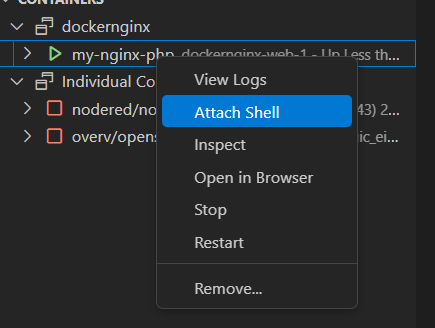

 
# Laravel

## Masuk ke shell docker
Klik kanan di container docker yang sedang jalan lalu attach Shell



## Eksekusi perinta perintah berikut ini di shell docker

### Beralih ke folder /var/www/html


```sh
cd /var/www/html/
```

### Membuat Project Laravel   
 Hal ini tidak diperlukan jika anda ingin membiarkan saja contoh laravel yang sudah ada di git ini

```sh
composer create-project --prefer-dist laravel/laravel nama_aplikasi  
```

### install laravel

```sh
cd nama_aplikasi && composer install
```

```sh
sudo chown -R www-data:www-data /var/www/html/nama_aplikasi/storage
```