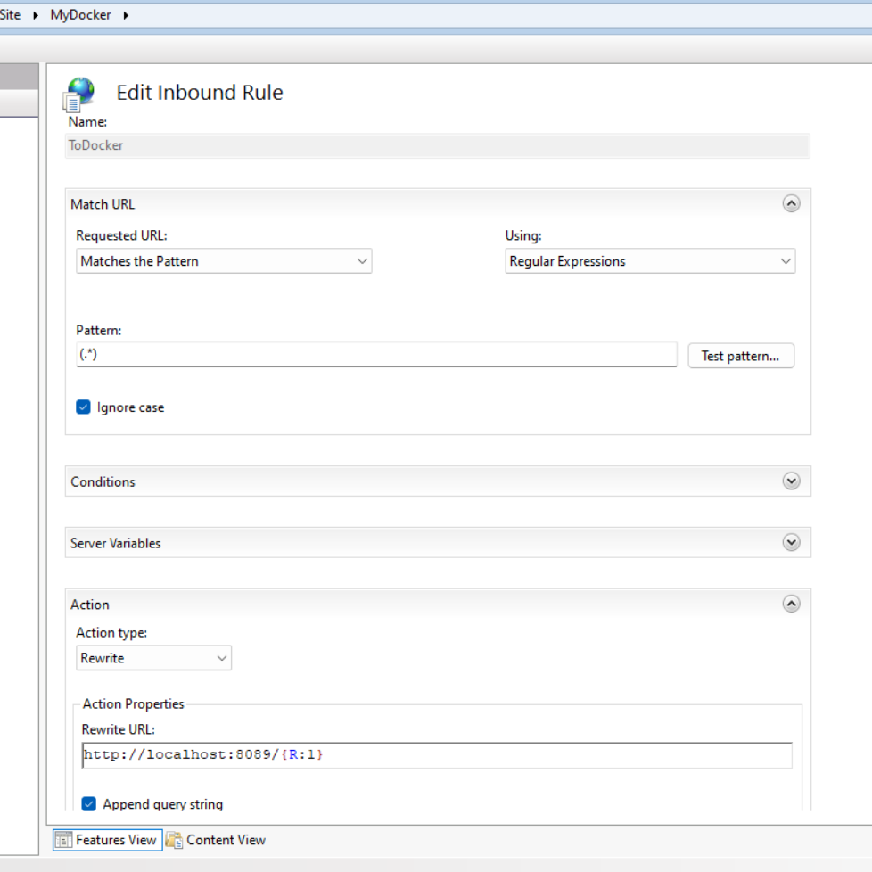

# Example IIS (Internet Information Services) Setup with Docker (nginx, php)

For the Indonesian version, you can click [here](./README_id.md).

## Clone This Repository

## Create Docker Image

Run the following command to create an image from the DockerFile.nginx you cloned from this repository.

```sh
docker buildx build -t my-nginx-php -f DockerFile.nginx .
```
note: Do not ignore the dot at the end

## Create Container and Run

To run the image and create the container, run the following command:

```bash
docker-compose -f ./run_docker.yml up -d
```

Now, you should be able to access it at http://localhost:8089/. It should be up and running. If you want to change the port, you can modify the `run_docker.yml` file.

## IIS Setup

- Install IIS and the URL Rewrite Module  
    https://iis-umbraco.azurewebsites.net/downloads/microsoft/url-rewrite
- Create an Application in IIS
- Klick Rewrite and add the following configuration, adjust it according to your website settings   
  
  ```txt
    
    Pattern : (.*)
    Rewrite URL : http://localhost:8089/{R:1}
  ```
  