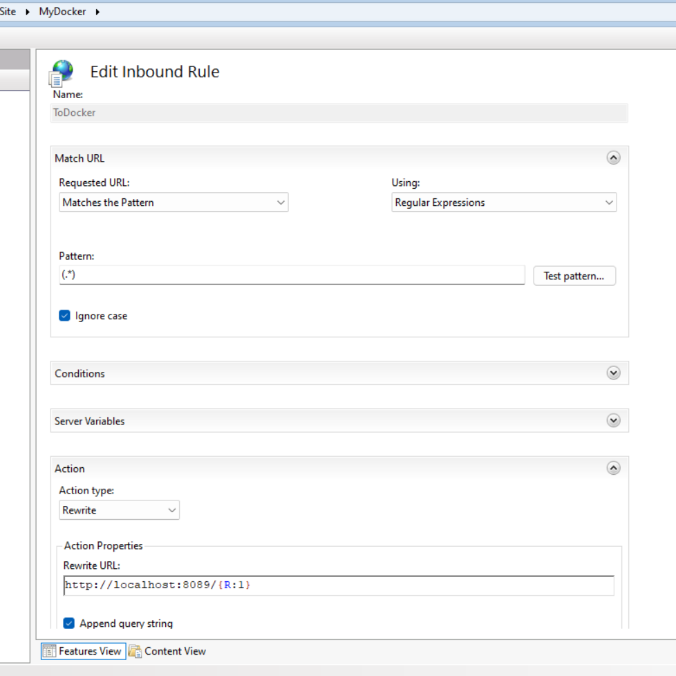

# Contoh Settup IIS (Internet Information Services) dengan Docker (nginx, php)

Untuk bahasa indonesia anda bisa klik di  

## Cloning Repositori ini 

## Buat Docker image 

Jalankan perintah berikut ini untuk membuat images dari DockerFile.nginx yang anda clone dari repo ini.

```sh
docker buildx build -t my-nginx-php -f DockerFile.nginx .

```
note : Jangan abaikan tanda titik di ujung

## Buat Container dan jalankan

Untuk menjalankan Image dan membuat container anda bisa menjalankan perintah berikut ini

```bash
docker-compose -f ./run_docker.yml up -d

```

Sekarang anda sudah bisa mengakses http://localhost:8089/ , dan seharusnya sudah tayang, jika anda ingin mengubah port anda bisa mengedit file run_docker.yml
 
## Settup IIS 

- Install IIS dan Module  URL Rewrite    
    https://iis-umbraco.azurewebsites.net/downloads/microsoft/url-rewrite 
- Buat Aplikasi Pada IIS
- Klick URL Rewrite dan masukan konfigurasi seperti ini, sesuaikan dengan settingan website anda   
  
  ```txt
    
    Pattern : (.*)
    Rewrite URL : http://localhost:8089/{R:1}
  ```
  

## Memahami Bind Mount dalam Docker Volumes
 
Pada file `run_docker.yml`, terdapat konfigurasi sebagai berikut:

```yml
version: '3'
services:
  web:
    image: my-nginx-php
    volumes:
      - ./src:/var/www/html
    ports:
      - "8089:80"
    restart: always
```

Pada bagian `volumes`, terdapat baris berikut:

```sh
./src:/var/www/html
```

Konfigurasi ini membuat bind mount yang menghubungkan folder `src` di komputer host ke folder `/var/www/html` di dalam container Docker. Dengan demikian, perubahan yang Anda lakukan pada file di folder `src` secara langsung tercermin di dalam container. Hal ini memudahkan pengembangan aplikasi karena Anda tidak perlu memuat ulang file secara manual ke dalam container. Nginx di dalam container secara otomatis akan menyajikan file dari folder yang telah di-mount tersebut.